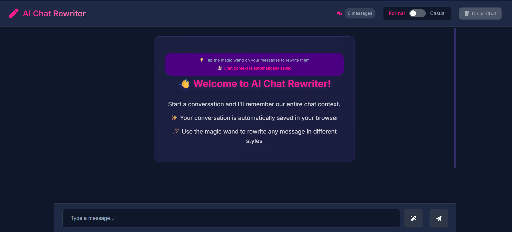

<h1 align="center">✨ Chatbot Rewriter ✨</h1>

<p align="center">
  <b>Rewrite your messages in Funny, Casual, or Formal styles with a single click!</b><br>
  Built with <a href="https://react.dev/">React</a> + <a href="https://vitejs.dev/">Vite</a>.
</p>

<p align="center">
  
  
</p>

---

## 🚀 Live Demo

👉 [Open the Live App](chatbbot-olive.vercel.app)

---

## 🪄 Features

- **Rewrite Suggestions:** Instantly rewrite your message as Funny, Casual, or Formal before sending.
- **Modern UI:** Responsive, beautiful chat interface with avatars and message bubbles.
- **Persistent Chat:** Your chat history is saved locally.
- **Theme Toggle:** Switch between chat styles from the navbar.
- **Easy to Use:** Clean, intuitive interface for seamless chatting.
- **Fast & Lightweight:** Powered by Vite for instant reloads and quick builds.

---

## 🖼️ Screenshots

<p align="center">
  
</p>

---

## 🛠️ Tech Stack

<p align="center">
  
</p>

- **React** for UI
- **Vite** for fast development
- **CSS** for styling

---

## 📦 Project Structure

```
src/
  components/
    ChatInterface.jsx      # Main chat UI and input
    MessageBubble.jsx      # Individual message bubbles
    RewriteModal.jsx       # Modal for rewritten messages
  App.jsx                  # App root
  main.jsx                 # Entry point
public/
  chat.png                 # Chat logo (if available)
```

---

## 🧑‍💻 Getting Started

1. **Clone the repository**
    ```bash
    git clone https://github.com/Vaibhavk121/chatbbot.git
    cd chatbbot
    ```
2. **Install dependencies**
    ```bash
    npm install
    ```
3. **Run the development server**
    ```bash
    npm run dev
    ```
4. **Open your browser** and visit [http://localhost:5173](http://localhost:5173)

---

## ✨ Usage

- Type your message in the input box.
- Click the <b>✨</b> button to get Funny, Casual, or Formal rewrites.
- Click a suggestion bubble to send that version.
- Enjoy chatting with style!

---

## 🤝 Contributing

Contributions, issues and feature requests are welcome!  
Feel free to check [issues page](https://github.com/your-username/your-repo/issues) if you want to contribute.

